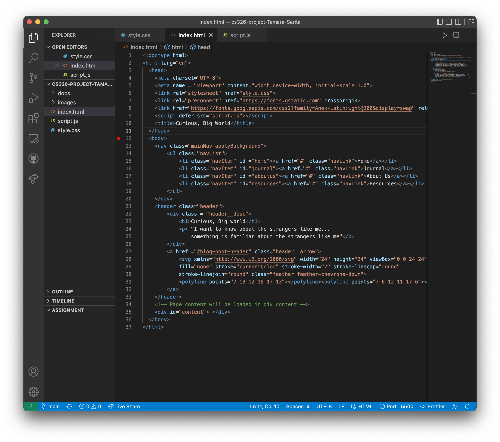

# Milestone 3 (work in progress)
# HTML File Description

- In the head of the HTML file I assign style.css as the stylesheet and script.js as my main script for rendering the website page. I also upload a font that will be used on the blogging website.
- In the body of the HTML file I create a class for the main navigation bar, the list of pages, and each individual page. Here I set up a couple of pages the user can click on to view different content. 
 - Below the main navigation is where the header class is created. Here I add the title for
the blog and a caption. I also add a down arrow the user can click on to smoothly transition to the page content. 
- After the header there is an empty div called content that will render different content for each individual page (with the help of the script.js file). Afterwards, we reach the end of the body section and html file.
- The script.js file contains more HTML (searchView, aboutusView, resourcesView, etc.). For the home page the HTML mostly consists of blog post titles, tags, and descriptions. The list of posts is stored in a section called blog posts and a div post container. The other content pages currently only contain header text.

# Data Interactions
- User is able to type into the search bar and filter through the blog posts for specific content. The search box will filter through all the post's tags, titles, and description. 

- User is able to click on a tag and prompt the page to automatically filter through related posts.

- User is able to switch through different blog pages and view different content. Currently, the only "completed" content page is the homepage, however a few more (about us and resources) will also be added. 

# Video Demo
Link: https://drive.google.com/file/d/1A3GwMy1PFpwuYyGKRyY57RZVRQKLByR4/view?usp=sharing